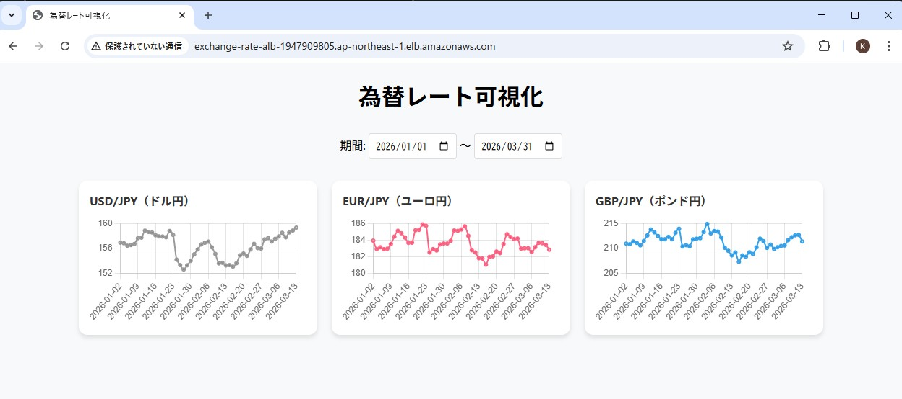
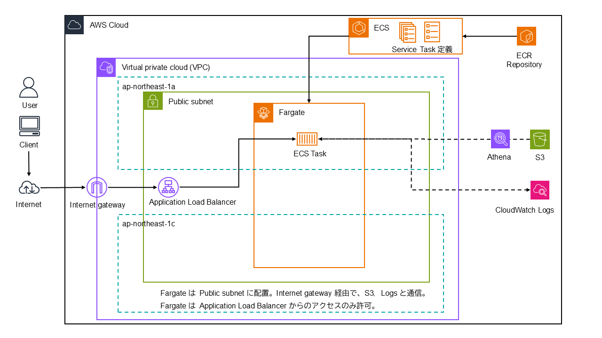
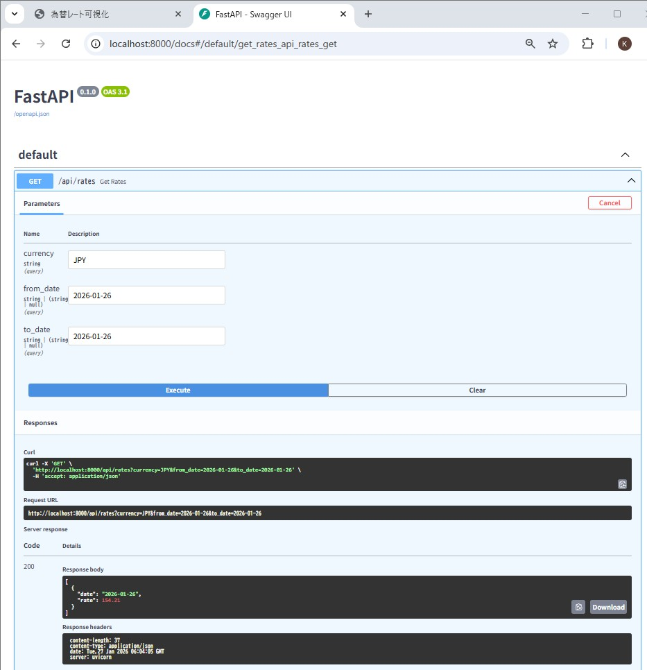
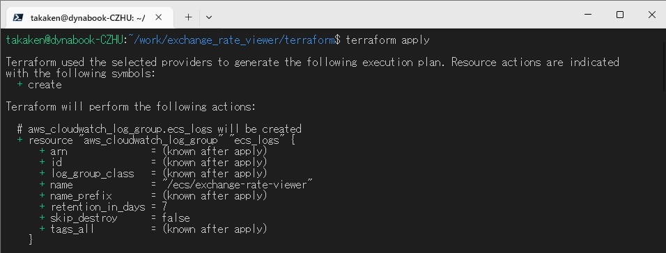
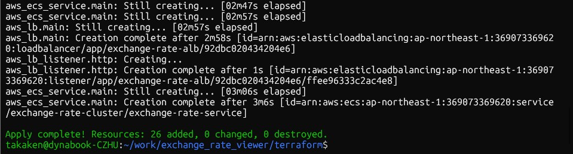
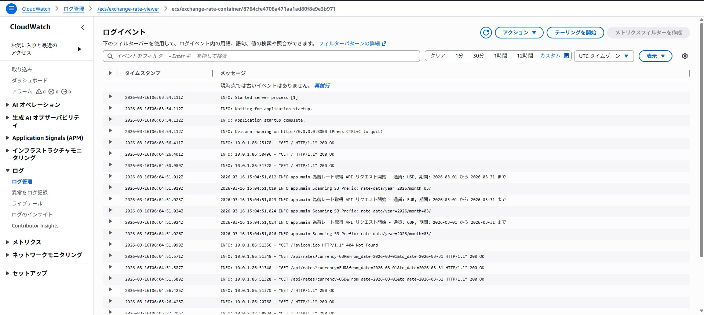
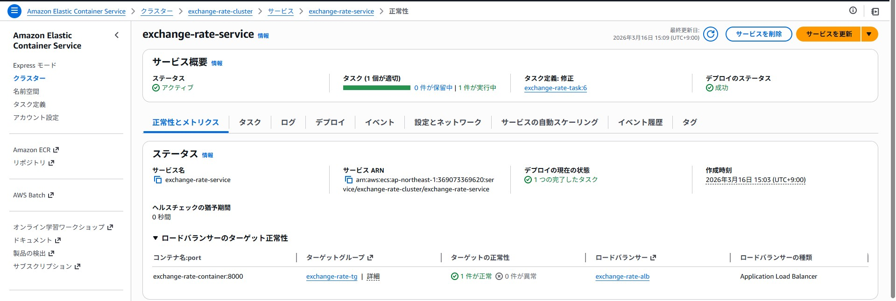

# Exchange Rate Viewer 為替レート可視化

## 概要
Amazon S3 に蓄積された為替レートを可視化する Webシステム

為替レート取得ツールが S3 に蓄積している為替レート（JSONファイル）を参照して可視化します。



## 使用技術
- **言語**: Python 3.11
- **ライブラリ**: FastAPI、uvicorn、boto3、Chart.js
- **インフラ**: AWS (ECS on Fargate、S3)

## 機能
- **データ取得**: Amazon S3 バケットから JSON形式の為替レートを取得
- **REST API**: 為替レート取得（パラメータ: 通貨コード、日付from、日付to）
- **データ表示**: Web ブラウザで為替レートをグラフ表示

### 為替レート取得 API（例）
リクエスト URL
```
http://localhost:8000/api/rates?currency=JPY&from_date=2026-01-26&to_date=2026-01-27
```

レスポンス Body
```
[
  {
    "date": "2026-01-26",
    "rate": 154.21
  },
  {
    "date": "2026-01-27",
    "rate": 153.34
  }
]
```

## システム構成



### Infrastructure as Code
AWS インフラは、Terraform を使用して作成しています。

個人開発ポートフォリオであることを踏まえ、コスト最小化を優先して、以下の設定にしています。
- Fargate タスクは、Public Subnet に配置する。VPC エンドポイント、または、NAT Gateway の利用を回避するため。
- Fargate タスクのセキュリティは ALB からの接続のみ許可で担保する。

## 開発環境
- **OS**: Windows 11 + WSL2 (Ubuntu)
- **環境構成**: Docker

### ローカル実行
プロジェクトルートにて以下のコマンドを実行します。

```bash
# SSO login
aws sso login

# Docker コンテナの起動
docker compose up
```

```
user_name@host_name:~/work/exchange_rate_viewer$ docker compose up
WARN[0000] No services to build
Attaching to app-1
app-1  | INFO:     Will watch for changes in these directories: ['/app']
app-1  | INFO:     Uvicorn running on http://0.0.0.0:80 (Press CTRL+C to quit)
app-1  | INFO:     Started reloader process [1] using WatchFiles
app-1  | INFO:     Started server process [8]
app-1  | INFO:     Waiting for application startup.
app-1  | INFO:     Application startup complete.
```

「Application startup complete.」が表示されたら、Webブラウザで `http://localhost:8000` にアクセスしてください。

APIドキュメントは `http://localhost:8000/docs` にて確認できます。



<!--
### テスト
pytest を使用して、テストを実行します。

```bash
# 起動中のコンテナで実行する場合
docker compose exec app pytest -v

# 新しくコンテナを起動して実行する場合
docker compose run --rm app pytest -v
```
-->

## 運用環境
### リリース準備
```bash
# 1. ビルド
docker build -f Dockerfile.prod -t exchange-rate-viewer:prod .

# 2. ローカルで起動・動作確認
docker run --rm -p 8000:8000 --env-file .env -v ~/.aws:/root/.aws exchange-rate-viewer:prod

# 3. ECRへプッシュ
docker push リポジトリURI
```
### AWSインフラ構築およびデブロイ
プロジェクトルート/terraform 配下で、以下のコマンドを実行します。

```bash
# 初期化（作業ディレクトリの準備）
terraform init
# チェック
terraform validate
# 実行計画の参照
terraform plan
# 作成または更新
terraform apply
```




### 運用状況
#### ログ（Amazon CloudWatch Logs）


#### ECS

